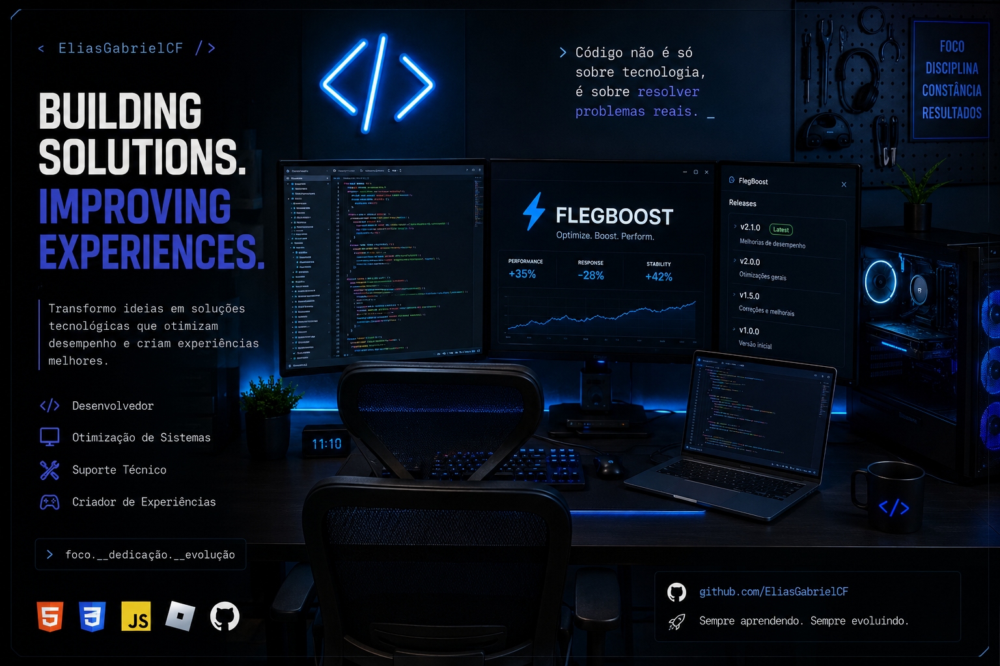

  

 

<table width="100%" style="border-collapse: collapse; border: none;">
  <tr style="border: none;">
    <td width="55%" style="border: none; vertical-align: top; padding-right: 20px;">
      <h2>👨‍💻 Minha Jornada</h2>
      
Sou um entusiasta de tecnologia com foco em iniciar minha carreira na área de TI, começando pela base. Com uma forte bagagem em rotinas administrativas e atendimento ao público, meu objetivo é unir <b>resolução estruturada de problemas</b> com <b>infraestrutura</b>.

      
Não sou um Desenvolvedor Fullstack! Sou um estudante curioso.  Adoro entender como o hardware e o sistema operacional funcionam, criar ferramentas para automatizar meu dia a dia e estou mergulhando de cabeça nos fundamentos de <b>Redes e Cybersegurança</b>.

       
      <h3>🎯 O que busco hoje:</h3>
      
Oportunidades em <b>Suporte de TI (Help Desk)</b> ou <b>Infraestrutura Júnior</b>, onde eu possa aplicar minha base técnica (manutenção, SO, scripts) e evoluir gradativamente na área de tecnologia.

    </td>
    <td width="45%" style="border: none; vertical-align: top; text-align: center;">
      
        
      
    </td>
  </tr>
</table>

 

<h2 align="center">⚙️ Fundamentos & Tecnologias Base</h2>

  
  
  
  
  
  

  

<h2 align="center">🛠️ Projetos em Destaque</h2>

<table width="100%" style="border-collapse: collapse; border: none;">
  <tr style="border: none;">
    <td width="50%" align="center" style="border: none; padding: 10px;">
      <h3>⚡ FlegBoost</h3>
      
<i>Software desenvolvido por mim para otimização de computadores, limpeza de processos e melhoria de performance em Sistemas Operacionais.</i>

      
    </td>
    <td width="50%" align="center" style="border: none; padding: 10px;">
      <h3>🤖 Master Store Bot</h3>
      
<i>Bot autônomo para Discord (Node.js) criado para gerenciar lojas, sistema de tickets e moderação, com banco de dados próprio.</i>

      
    </td>
  </tr>
</table>
